# Agent 运行时上下文

本页解释 Yuxi 如何从持久化 Agent 配置构建一次运行，以及配置、权限、文件和 LangGraph state 在运行中分别负责什么。Agent 配置和扩展开发见[配置和开发智能体](../agents/agents-config.md)。

## 运行入口

普通聊天、恢复审批和子智能体运行都会从服务端事实重建 Context：

```mermaid
flowchart LR
    Request["请求 / resume"] --> Binding["Conversation 与 Agent 绑定"]
    Binding --> Config["Agent config_json.context"]
    Config --> Identity["uid / thread / run / request"]
    Identity --> Workspace["AGENTS.md / USER.md"]
    Workspace --> Prepare["按用户权限归一化资源"]
    Prepare --> Graph["get_graph(context)"]
    Graph --> State["LangGraph state + PostgreSQL checkpoint"]
    State --> Result["消息、事件、文件和产物"]
```

具体顺序是：

1. 新线程根据 `agent_slug` 查找当前用户可访问的 Agent；已有线程使用已绑定的 Agent。
2. 服务读取 `config_json.context`，加入当前用户和运行身份。
3. 运行入口读取用户工作区的 `agents/AGENTS.md` 和 `agents/USER.md`，把非空内容追加到系统提示词；文件不存在或不可读不会阻断运行，每个文件最多读取 64 KiB。
4. `prepare_agent_runtime_context` 重新按当前用户权限过滤工具、知识库、MCP、Skills 和子智能体，并展开 Skill 依赖。
5. 没有配置模型时，系统读取管理员设置的默认模型；然后 `get_graph(context)` 创建模型、工具和中间件。
6. LangGraph state 保存消息、待办、文件、产物和子智能体状态；checkpoint 只使用 PostgreSQL。

API/worker 不信任浏览器内存中的完整配置。请求可以提供受限的单次覆盖值，例如模型或工具审批模式；其余配置从已保存的 Agent 和用户权限重新计算。

## 配置和运行态的区别

| 数据 | 来源 | 生命周期 |
| --- | --- | --- |
| `config_json.context` | Agent 管理页面/管理 API | 跨运行保存的配置 |
| `runtime.context` | 配置 + 用户身份 + 运行身份 + 权限快照 | 当前 Run |
| LangGraph state | Graph 执行和中间件 | 当前 checkpoint thread |
| PostgreSQL Message/AgentRun | 服务和 worker 提交 | 业务事实和运行结果 |

中间件可以在 Graph 创建和模型请求之间派生运行时字段，例如 `_visible_knowledge_bases`、`_effective_skill_slugs` 和 token 快照。这些字段不是用户可以任意提交的权限声明。

## 资源权限

- `tools`、`knowledges`、`mcps` 和 `skills` 未配置时，使用当前用户可访问的全部资源；显式列表只保留列表中的资源；显式空列表不启用该类资源。
- `ChatBotContext.subagents` 未配置或保存空列表时，使用当前用户可见的全部子智能体；显式列表才会收窄范围。
- Agent 的知识库选择只能缩小用户已经拥有的读取权限。
- Skill 选择控制 Prompt 和工具激活；共享 Skill 的文件投影按用户授权生成，个人 Skill 位于 UserWorkspace。
资源快照只解决运行时“能看见哪些资源”。产生文件、知识库、MCP 或外部系统副作用的工具还要在执行处校验具体目标和当前身份。

## 文件和 Memory

当前 Project 的 `workdir_path` 决定 Agent 的默认工作目录。普通 Agent 和子 Agent 共享根 Conversation 的 Workdir 与 execution runtime；子 Agent 的 child thread 只隔离 LangGraph checkpoint，不隔离文件。

`agents/MEMORY.md` 只有在用户配置 `enable_memory=true`，且该文件存在并包含非空内容时，才由主 Agent 的 Memory middleware 读取并提供受限的记忆工具。它是用户主动维护的参考资料，不是系统指令；子 Agent 不直接使用该 middleware。Memory 读取和更新有独立的用户、Run、worker 和文件大小校验。

Viewer、附件和 artifact API 通过持久化 Workspace/Workdir 读取文件，不连接 Agent execution runtime。沙盒虚拟路径、Viewer scope、对象 URL 和宿主机路径在各自边界中转换，不能互相替代。

## 用户定时 Agent

用户定时 Agent 由 `scheduled_agent_jobs` 保存 Project、Agent、提示词、审批模式和计划，worker 在 PostgreSQL 行锁下为到期任务创建唯一 occurrence。每次 occurrence 创建绑定原 Project 的独立 Conversation，并复用统一 AgentRun Request/Run 链路；触发记录只保存配置快照和提交状态，排队与执行状态分别从 AgentRunRequest 和 AgentRun 读取。明确的领域错误终结 occurrence，未知瞬时错误在下一轮重查 Request；单条失败不阻断同批任务。Redis/ARQ 只负责唤醒。

任务 API 只返回当前用户拥有且未删除的任务，并在创建、更新和触发时重新校验 Project 归属与 Agent 可见性。停用或任务软删除只阻止未来触发；账号软删除在同一事务删除任务及 occurrence。任务支持 Run now、5 段 cron 和 IANA 时区，数据库保存 UTC 下一次触发时间；错过多个周期只合并一次，已有非终态执行时记录 skipped。

## 恢复和失败

审批或用户问题中断时，系统把中断信息保存在对应 Run/checkpoint。resume 会根据线程绑定的 Agent 和当前用户重新构建 Context，再创建新的 Run；它不会从相邻 Run 猜测模型、工具或文件结果。

如果 Agent 配置、模型、权限或工作区文件在两个 Run 之间发生变化，新的运行会使用新的有效配置；已完成 Run 的输出和事件仍绑定原来的 `request_id`、`run_id` 和消息。

## 源码和验证入口

- [Context 与资源归一化](https://github.com/xerrors/Yuxi/blob/main/backend/package/yuxi/agents/context.py)
- [BaseAgent](https://github.com/xerrors/Yuxi/blob/main/backend/package/yuxi/agents/base.py)
- [Chatbot graph](https://github.com/xerrors/Yuxi/blob/main/backend/package/yuxi/agents/buildin/chatbot/graph.py)
- [SubAgent graph](https://github.com/xerrors/Yuxi/blob/main/backend/package/yuxi/agents/buildin/subagent/graph.py)
- [Memory middleware](https://github.com/xerrors/Yuxi/blob/main/backend/package/yuxi/agents/middlewares/memory.py)
- [运行时上下文 unit](https://github.com/xerrors/Yuxi/tree/main/backend/test/unit/agents)
- [Agent 主链路 E2E](https://github.com/xerrors/Yuxi/tree/main/backend/test/e2e)

修改配置、权限、模型可见输入、文件作用域或恢复语义时，同时验证对应的 unit、integration 或 E2E，并回读最终 state、消息、文件或协议结果。

## 线程阅读数据

`GET /api/chat/thread/{thread_id}/history` 返回当前用户可见线程的 `thread`、`runs` 和 `history`。`thread` 复用线程列表的标题、Project、Workdir 和状态投影；`runs` 按创建时间与 ID 排序，包含该 Conversation 的全部轻量 Run，包括没有普通消息的失败、取消和运行中记录。当前 History 不分页，Runs 与其采用相同的完整线程范围；Model/Tool 详细审计仍由独立审计接口按需读取。

`runs` 每项包含 `run_id`、`request_id`、`run_type`、`created_by_run_id`、`status` 和 `timing`。Run 输入、运行清单和内部执行数据不进入这个阅读投影。`history` 中的消息通过 `run_id` 关联 Run，不包含 `run_timing`、`run_started_at` 或 `run_finished_at`；没有 Run 关联的旧消息仍保留。前端分别存储消息与 Runs，按 Run ID 分组，回复耗时和调试 Run 详情读取同一 Run 时间投影。

History 读取不改变已读标记。页面加载历史后以 `POST /api/chat/thread/{thread_id}/viewed` 显式标记已查看，并使用该操作返回的 Thread 更新侧栏。读取未知、已删除或其他用户的线程返回 404。多个查询遵循当前数据库事务隔离；响应不承诺跨 SQL 原子快照，运行中变化通过 SSE 与持久化重读收敛。

接口契约由 `conversation_service` 装配、`ConversationRepository` 查询和前端 History consumers 共同拥有；真实 HTTP 测试回读 Run、消息和 PostgreSQL 已读标记，覆盖超过审计窗口的完整历史与用户隔离。取舍与兼容影响见 [前端优化](../develop-guides/decisions/implemented/2026-09-05-frontend-optimization.md)。
