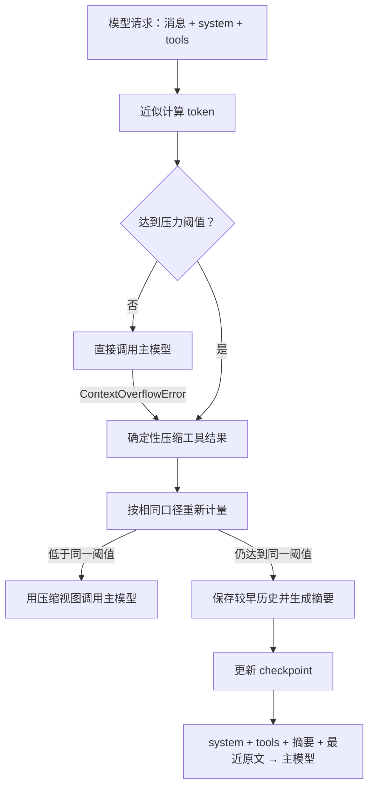

# 上下文压缩机制

长对话和大段工具结果会占用模型上下文。Yuxi 使用一个压力阈值控制自动压缩：请求达到阈值后先确定性压缩大工具结果，重新计量后仍达到同一阈值才调用摘要模型。配置入口见[智能体配置](../agents/agents-config.md)，中间件顺序见[中间件](../agents/middleware.md)。

## 先记住三件事

1. PostgreSQL 中的聊天消息不会因为压缩被删除。
2. 确定性压缩只修改模型请求视图；完整工具结果先写入当前 Workdir。
3. 摘要更新 LangGraph checkpoint 的 `_summarization_event`；后续请求继续注入当前 Agent 的 system prompt、tools、摘要和未压缩的最近消息。

## 自动压缩流程

入口阈值没有达到时，Yuxi 直接调用主模型。请求达到阈值后，确定性压缩先执行；压缩后的请求低于同一阈值时不调用摘要模型。主模型返回 `ContextOverflowError` 时，系统把它视为强制摘要信号。

## 确定性工具结果压缩

确定性压缩为本次模型请求创建较小的消息视图：

- `write_file` 和 `edit_file` 的过长参数截断为短提示，单次参数上限是 2,000 个字符；
- 超过 `summary_tool_result_token_limit` 的工具结果完整写入 `outputs/large_tool_results/`，请求中只保留文件路径、内容哈希和近似 token 上限内的预览；
- `query_kb` 和 `web_search` 解析 JSON，并在预算内按原顺序保留结果数量、文档或网页标识、来源、标题、URL、分数和受限正文预览；
- 其他工具结果保留 head、middle 和 tail；
- 文件名使用工具名和内容哈希，同一内容可以稳定定位。

token 数使用近似计算，只用于压力判断和预览长度，不是计费口径。完整结果无法写入 Workdir 时，系统拒绝用裁剪内容替换原 ToolMessage。

## 摘要和 checkpoint

摘要器从较早历史中选择待摘要区间，优先保留 `summary_keep_messages` 条最近消息。选中的历史写入当前 Workdir 的 `outputs/conversation_history/`，摘要模型根据这段历史生成一条 summary message。

成功后，`_summarization_event` 保存累计 cutoff、摘要消息和历史文件路径。后续请求根据这个事件跳过已摘要区间，只发送当前摘要和 cutoff 之后的原始消息。再次压缩时，局部 cutoff 会换算成完整 state 的位置。

checkpoint 只拥有模型继续运行所需的压缩视图；PostgreSQL Message 继续保存完整聊天记录。system prompt 和 tool schemas 由每次运行的当前 Agent 配置重新装配，不存入摘要 event。

## 主动压缩

声明 `context_compression` capability 的 Agent 会在聊天状态面板显示“压缩上下文”按钮。按钮发起一次同步维护请求，不创建 AgentRun、排队请求或新的 Run 类型。

服务从检查空闲到 checkpoint 更新期间持有 Conversation 行锁。线程存在运行中 Run、等待交互的 Run 或排队 Request 时返回 `409 thread_busy`；普通请求接入使用同一把锁，因此不会与主动压缩并发修改同一线程。

服务通过当前 Agent 的 canonical compiled graph 读取和更新 state，不直接操作 checkpoint 表。压缩期间创建或复用的 Sandbox 在请求结束时释放。成功后前端重新读取 Agent state；由于这次维护请求没有完整主模型请求形状，上一次 system/tool 压力估算会失效，下一次主模型调用重新生成完整压力数据。

## 事件和状态提示

自动压缩会发送三个 custom event：

- `started`：开始确定性压缩或摘要；
- `completed`：压缩处理后的主模型调用成功；
- `failed`：压缩过程中出现未处理异常。

`chat_service` 把它们映射为 SSE 的 `context_compression` 事件。SSE 只负责实时提示；可恢复的摘要状态以对应 Run 的 checkpoint 为准，历史内容以 Workdir 文件为准。内部摘要模型带有 `TAG_NOSTREAM`，不会作为用户可见的助手消息流出。

状态面板使用下一轮模型输入的近似 token 与 `summary_threshold` 计算压力。达到阈值的 85% 时显示手动压缩建议；85% 只影响提示，不参与自动压缩。

## 配置字段

| 字段 | 默认值 | 作用 |
| --- | ---: | --- |
| `summary_threshold` | `100` | 唯一压力阈值，单位 K，装配时换算为约 1024 倍 token |
| `summary_keep_messages` | `10` | 摘要后优先保留的最近消息数 |
| `summary_prompt` | 内置中文模板 | 摘要提示词，必须包含 `{messages}` |
| `summary_tool_result_token_limit` | `300` | 工具结果的近似 token 阈值和预览上限 |

降低 `summary_threshold` 会更早进入压缩流程；增加保留消息数会增加摘要后的请求体。修改参数后用典型工具输出和目标模型上下文窗口做实际验证。

## 文件、权限和用量

摘要历史和长工具结果写入当前 Conversation 的 Project Workdir。主 Agent 和子 Agent 共享根执行树的文件作用域，因此子 Agent 也可能看到这些文件。文件内容可能包含完整工具返回和用户对话，应按用户数据保护。

路径由 Workspace/Sandbox backend 校验；公共 Skill 目录不可写，宿主机路径不会暴露给模型。文件写入过程不做脱敏或加密。

Summary 触发使用近似 token 统计；主模型返回的 `usage_metadata` 用于实际用量记录，但 `siliconflow-cn` 和 `siliconflow` 当前被排除在 Provider 用量聚合之外。内部摘要模型调用不进入这组统计，因此不能把状态面板数据直接当作完整账单。

## 失败和恢复

自动摘要无法保存历史文件时会记录错误，较早原文可能无法从 Workdir 恢复；摘要模型失败时错误文本会进入摘要视图，主模型调用仍可能继续。主动压缩要求历史文件和摘要都成功，失败时返回错误且不发布新的摘要 event。

| 现象 | 先检查 |
| --- | --- |
| 事件显示开始但没有完成 | 同一 Run 的 error 事件、worker 日志和主模型错误 |
| 摘要后找不到旧内容 | checkpoint 的 `_summarization_event.file_path` 和 Workdir 中的历史文件 |
| 主动压缩返回 `thread_busy` | 同线程的活跃 Run、等待交互状态和 FIFO 排队请求 |
| 任务仍提示上下文过大 | 确定性压缩视图、保留消息数、工具 schemas 和目标模型上下文上限 |
| 前端出现摘要文本 | 检查是否把内部摘要流误当成 messages 事件 |

不要从相邻 Run 的摘要文件或消息推断当前 Run 的结果。

## 源码定位与验证

- [Summary middleware](https://github.com/xerrors/Yuxi/blob/main/backend/package/yuxi/agents/middlewares/summary.py)
- [主动压缩 service](https://github.com/xerrors/Yuxi/blob/main/backend/package/yuxi/services/context_compression_service.py)
- [Agent state repository](https://github.com/xerrors/Yuxi/blob/main/backend/package/yuxi/repositories/agent_state_repository.py)
- [Agent 配置](https://github.com/xerrors/Yuxi/blob/main/backend/package/yuxi/agents/context.py)
- [Chatbot graph](https://github.com/xerrors/Yuxi/blob/main/backend/package/yuxi/agents/buildin/chatbot/graph.py)
- [Token usage](https://github.com/xerrors/Yuxi/blob/main/backend/package/yuxi/agents/middlewares/token_usage.py)
- [Summary unit tests](https://github.com/xerrors/Yuxi/tree/main/backend/test/unit/middlewares)
- [主动压缩 service tests](https://github.com/xerrors/Yuxi/blob/main/backend/test/unit/services/test_context_compression_service.py)
- [真实模型 integration test](https://github.com/xerrors/Yuxi/blob/main/backend/test/integration/services/test_summary_middleware_real_model.py)

修改压缩逻辑时，至少验证低于阈值、确定性压缩后低于同一阈值、进入摘要、结构化检索预览、历史写入失败、摘要模型失败、主动压缩 busy 拒绝、Sandbox 回收和 overflow 尾部裁剪；oracle 应读取消息视图、state update、Workdir 文件或协议结果。
